class: center middle

# Find.Me Architektur
### Ruben Gees, Alexej Esau

---

# Inhaltsverzeichnis

- Überblick

- CouchDB

  - API

- React.js Website

- Reacht Native App

---

# Überblick: Architekturdiagramm


---

# CouchDB

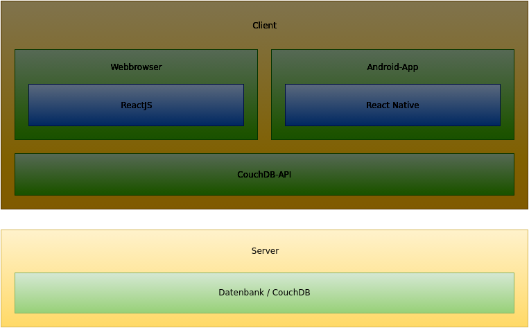

---

.left-column[
## CouchDB
### Übersicht
]

.right-column[
- NoSQL Datenbank

  - Dokumentenbasiert

- Persistierung der Daten
]

---

.left-column[
## CouchDB
### Übersicht
### Schema
]

.right-column[
<center>
  
</center>
]

---

# CouchDB API

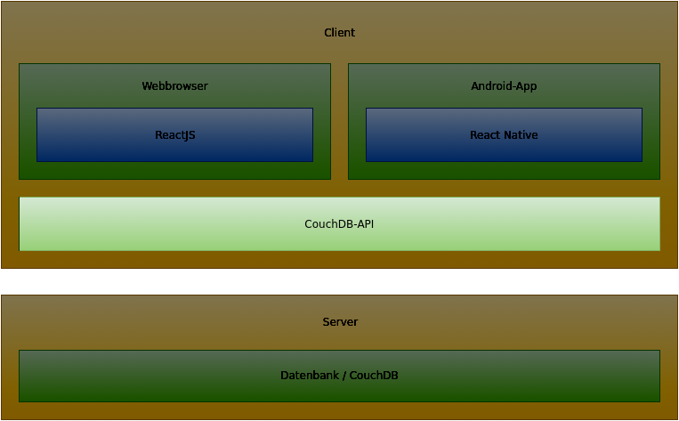

---

.left-column[
## CouchDB API
### Übersicht
]

.right-column[
#### Ziel: Saubere Schnittstelle/Abstraktion zur Datenbank
- Enthält Sammlungen von DAOs

- Sowohl für React.js als auch für React Native
]

---

.left-column[
## CouchDB API
### Übersicht
### DAO
]

.right-column[
- Zugriffsschnittstelle für bestimmten Dokumententyp

- Bietet Methoden zum...

  - Erstellen von Objekten

  - Aktualisieren von Objekten

  - Löschen von Objekten

  - Suchen von Objekten anhand von Kriterien (Id, Name, ...)
]

---

.left-column[
## CouchDB API
### Übersicht
### DAO
### Beispiel: User
]

.right-column[
<center>
  
</center>
]

---

.left-column[
## CouchDB API
### Übersicht
### DAO
### Beispiel: User
]

.right-column[

Callback Variante

```javascript
let login = "username";
let dm = new CouchDbApi.DaoManager(connSettings);
let userDao = dm.getDao(CouchDbApi.UserDAO);

userDao.findByLogin(login, {
    success: function(data) {
        // Do something with the data
    },
    error: function(err) {
        // Log/Show/Handle error
    }
});
```

Promise Variante

```javascript
let login = "username";
let dm = new CouchDbApi.DaoManager(connSettings);
let userDao = dm.getDao(CouchDbApi.UserDAO);

userDao.findByLogin(login)
    .then(function(data){
        // Do something with the data
    })
    .catch(function(err){
        // Log/Show/Handle error
    });
```
]

---

# React.js Website

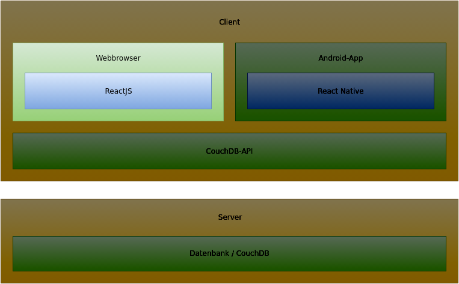

---

.left-column[
## React.js Website
### Übersicht
]

.right-column[
- JSX-UI Framework

- Entwickelt durch Facebook

- Entwicklung mittels JavaScript Komponenten (Objekte/Klassen)

- Ausschließlich UI Framework

- Kein Business Logic Layer
]

---

.left-column[
## React.js Website
### Übersicht
### Weitere Technologien
]

.right-column[
#### Projektumgebung

- npm

- webpack

- Karma

- Jasmine

- ESLint

- Babel
]

---

.left-column[
## React.js Website
### Übersicht
### Weitere Technologien
]

.right-column[
#### Biblotheken

- react-router

- lodash

- q

- jQuery

- Bootstrap
]

---

.left-column[
## React.js Website
### Übersicht
### Weitere Technologien
### Viewerzeugung
]

.right-column[
#### Projektstruktur
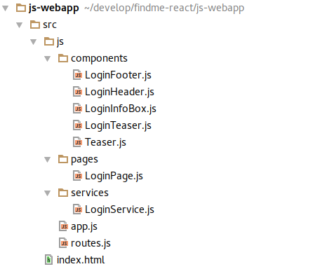
]

---

.left-column[
## React.js Website
### Übersicht
### Weitere Technologien
### Viewerzeugung
]

.right-column[
#### Ausgangssituation
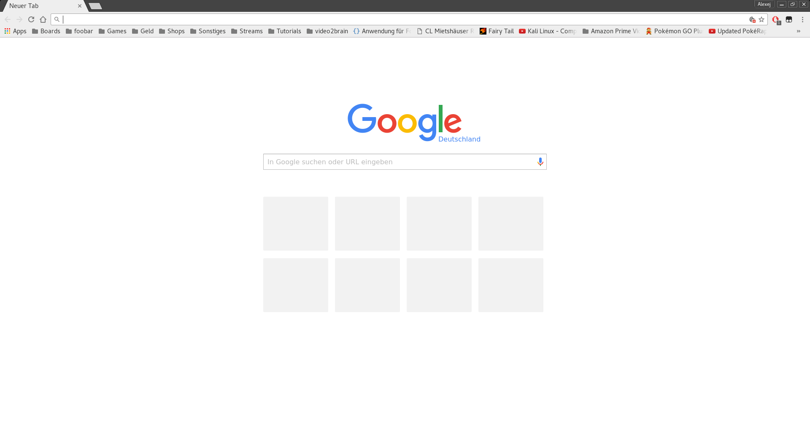
]

---

.left-column[
## React.js Website
### Übersicht
### Weitere Technologien
### Viewerzeugung
]

.right-column[
#### Formaler Ablauf
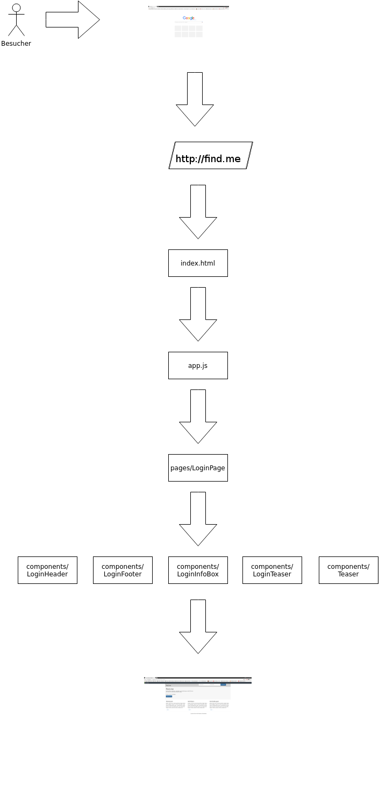
]

---

.left-column[
## React.js Website
### Übersicht
### Weitere Technologien
### Viewerzeugung
]

.right-column[
#### Endergebnis
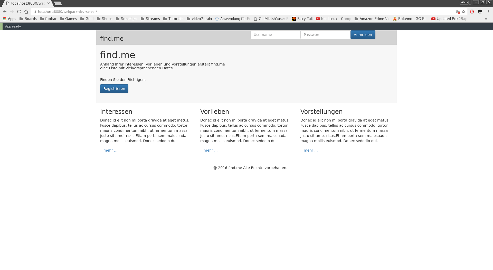
]

---

.left-column[
## React.js Website
### Übersicht
### Weitere Technologien
### Viewerzeugung
]

.right-column[
#### LoginPage-Code

```js
export default class LoginPage extends React.Component {
    constructor(props) {
        super(props);

        if (localStorage.getItem("sessionUserId")) {
            location.href = "#/profile";
        }
    }

    render() {
        return (
            <div>
                <LoginHeader/>
                <LoginInfoBox/>
                <LoginTeaser/>
                <LoginFooter/>
            </div>
        );
    }
}
```
]

---

.left-column[
## React.js Website
### Übersicht
### Weitere Technologien
### Viewerzeugung
]

.right-column[
#### LoginHeader-Code

```js
export default class LoginHeader extends React.Component {
    render() {
        return (
            <div>
                <!-- ... -->
                <button type="button"
                className="btn btn-primary"
                onClick={this.login}>Anmelden</button>
                <!-- ... -->
            </div>
        );
    }

    login() {
        let loginService = new LoginService();

        loginService.login($("#username").val(),
                           $("#password").val(), {
            success: function (data) {
                location.href = "#/profile";
            },
            error: function (err) {
                console.log(err);
            }
        });
    }
}
```
]

---

.left-column[
## React.js Website
### Übersicht
### Weitere Technologien
### Viewerzeugung
]

.right-column[
#### LoginFooter-Code

```js
export default class LoginFooter extends React.Component {
    render() {
        return (
            <div className="container">
                <div className="row">
                    <hr />
                    <div className="text-center">
                    @ 2016 find.me Alle Rechte vorbehalten.
                    </div>
                </div>
            </div>
        );
    }
}
```
]

---

.left-column[
## React.js Website
### Übersicht
### Weitere Technologien
### Viewerzeugung
]

.right-column[
#### LoginInfoBox

```js
export default class LoginInfoBox extends React.Component {
    render() {
        return (
            <div>
                <div className="row"
                style={{backgroundColor: "#F7F7F7"}}>
                    <div className="col-md-12">
                        <h1 className="title">find.me</h1>
                        <h5 className="info">
                            Anhand Ihrer Interessen,
                            Vorlieben und Vorstellungen
                            erstellt find.me<br/>
                            eine Liste mit vielversprechenden
                            Dates.
                            <br/>
                            <br/>
                            <br/>
                            Finden Sie den Richtigen.
                        </h5>
                        <a className="btn btn-primary"
                        href="#/register">Registrieren</a>
                    </div>
                </div>
            </div>
        );
    }
}
```
]

---

.left-column[
## React.js Website
### Übersicht
### Weitere Technologien
### Viewerzeugung
]

.right-column[
#### LoginTeaser-Code

```js
export default class LoginTeaser extends React.Component {
 render() {
   let self = this;
   return (
     <div>
       <div className="row">
         <div className="col-md-4">
           <Teaser header="Interessen"
                 description={self.createRandomDescription()}
                 destination="#"/>
         </div>
         <div className="col-md-4">
           <Teaser header="Vorlieben"
                 description={self.createRandomDescription()}
                 destination="#"/>
         </div>
         <div className="col-md-4">
           <Teaser header="Vorstellungen"
                 description={self.createRandomDescription()}
                 destination="#"/>
         </div>
       </div>
     </div>
   );
 }
 createRandomDescription() {
   return "some cool stuff";
 }
}
```
]

---

.left-column[
## React.js Website
### Übersicht
### Weitere Technologien
### Viewerzeugung
]

.right-column[
#### Teaser-Code

```js
export default class Teaser extends React.Component {
    render() {
        let self = this;

        return (
            <div>
                <h3>{self.props.header}</h3>
                <p>{self.props.description}</p>
                {(() => {
                    if (self.props.destination) {
                        return (<a className="btn btn-link"
                        href={self.props.destination}>mehr
                        ...</a>);
                    }
                })()}
            </div>
        );
    }
}
```
]

---

.left-column[
## React.js Website
### Übersicht
### Weitere Technologien
### Viewerzeugung
]

.right-column[
#### LoginService

```js
export default class LoginService {
 login(login, password, callbacks) {
  let dm = new CouchDbApi.DaoManager(connSettings);
  let userDao = dm.getDao(CouchDbApi.UserDAO);

  userDao.findByLogin(login, {
   success: function(data) {
    if (data && data[0].password === password) {
     if (callbacks && typeof callbacks.success === "function") {
      localStorage.setItem("sessionUserId", data[0]._id);
      callbacks.success(data);
     }
    } else {
     if (callbacks && typeof callbacks.error === "function") {
      callbacks.error("wrong username or password");
     }
    }
   },
   error: function(err) {
    console.error(err);
    if (callbacks && typeof callbacks.error === "function") {
     callbacks.error(err);
    }
   }
  });
 }
}
```
]

---

.left-column[
## React.js Website
### Übersicht
### Weitere Technologien
### Viewerzeugung
]

.right-column[
#### Zusammenfassung

- Webbrowser fordert konkrete Page an

    - Routing-Modul

- Page lädt Sub-Komponenten

    - Fragmentierung von Komponenten möglich

    - Gute Wiederverwendbarkeit der Komponenten

- Webbrowser zeigt gerendertes Ergebnis
]

---

.left-column[
## React.js Website
### Übersicht
### Weitere Technologien
### Viewerzeugung
### Deployment
]

.right-column[
- Bundler: webpack

- npm-Tasks

    - `npm run startDev`

        - Startet `webpack-dev-server --watch --inline --hot`

        - Entwicklerseite aufrufbar unter `http://localhost:8080/webpack-dev-server/`

    - `npm run dist`

        - Startet `webpack`

        - Distribution in Ordner `dist/`
]

---

# Reacht Native App

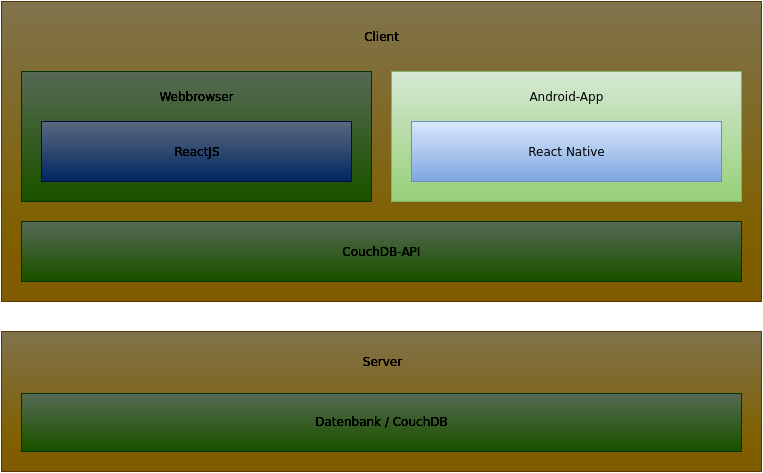

---

.left-column[
## React Native App
### Übersicht
]

.right-column[
- Framework zum Schreiben von nativen Apps für Android und IOs mithilfe von
  Javascript

- Ausführen von JavaScript zur Laufzeit und Darstellung in nativen Komponenten
  wie zum Beispiel einer `TextView`

- Vorteil: Nutzung der vielen bestehenden Bibliotheken für Javascript und
  verhältnismäßig einfache Implementierung
]

---

.left-column[
## React Native App
### Übersicht
### Bibliotheken
]

.right-column[
- lodash: Helferfunktionen

- [react-native-vector-icons](https://github.com/oblador/react-native-vector-icons): Verschiedene Icons für zum Beispiel die Toolbar

- [react-native-image-picker](https://github.com/marcshilling/react-native-image-picker): Zum Aufnehmen oder Auswählen von Fotos
]

---

.left-column[
## React Native App
### Übersicht
### Bibliotheken
### Projektaufbau: Übersicht
]

.right-column[
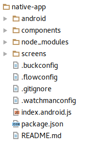

- Verschiedene Konfigurationsdateien für Deployment und Verwaltung

- `android` enthält vorgegebene Projektstruktur von React Native (Gradle wird     genutzt)

- `node_modules` enthält JavaScript Bibliotheken
]

---

.left-column[
## React Native App
### Übersicht
### Bibliotheken
### Projektaufbau: Komponenten
]

.right-column[
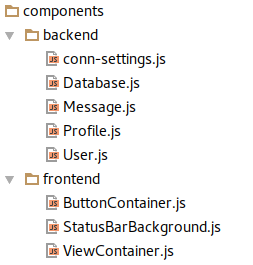

- Aufteilung in frontend und backend

  - frontend enthält View Komponenten die an mehreren Stellen benutzt werden

  - backend enthält Klassen zum Datenzugriff
]

---

.left-column[
## React Native App
### Übersicht
### Bibliotheken
### Projektaufbau: Screens
]

.right-column[
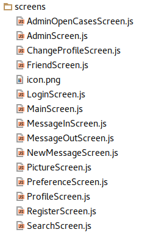

- Alle verschiedenen Screens ohne besondere Hierachien
]

---

.left-column[
## React Native App
### Übersicht
### Bibliotheken
### Projektaufbau
### Beispiel: Login View
]

.right-column[
```xml
<View style={styles.inputContainerView}>
    <Text style={styles.text}>
        Login :
    </Text>
    <TextInput
        style={styles.input}
        onChangeText={username => this.setState({username})}
        placeholder="E-Mail">
    </TextInput>
</View>
<View style={styles.inputContainerView}>
    <Text style={styles.text}>
        Password :
    </Text>
    <TextInput
        style={styles.input}
        onChangeText={password => this.setState({password})}
        placeholder="Passwort"
        secureTextEntry = {true}>
    </TextInput>
</View>
<ButtonContainer>
    <TouchableHighlight
        onPress={()=>this._login(this, this.state.username,
        this.state.password>
        <Text style={styles.btnText}>
            Einloggen
        </Text>
    </TouchableHighlight>
</ButtonContainer>
```
]

---

.left-column[
## React Native App
### Übersicht
### Bibliotheken
### Projektaufbau
### Beispiel: Login Logik
]

.right-column[
```javascript
_login(self, pUser, pPassword) {
    var db = Database.getInstance();

    db.user.findByLogin(pUser, {
        function (data) {
            var receivedUser = data[0];

            if (receivedUser.password === pPassword) {
                var user = User.getInstance();
                user.currentUSER.user = receivedUser;

                if (receivedUser.role === 2) {
                    self._navigateToAdminMenue();
                } else {
                    self._getProfile();
                }
            } else {
                Alert.alert('Passwort',
                    "Das Passwort passt nicht zum " +
                    "angegebenen Benutzer.",
                    [{text: 'ok'}]);
            }
        }, function (err) {
            Alert.alert('Fehler', "Es gab einen " +
                "Fehler bei der Datenbankanfrage.",
                [{text: 'ok'}]);
        }
    });
}
```
]

---

.left-column[
## React Native App
### Übersicht
### Bibliotheken
### Projektaufbau
### Beispiel: Login Navigation
]

.right-column[
```javascript
_navigateToMainMenue() {
    this.props.navigator.push({
        ident: "Main"
    })
}
```

Aus `index.android.js`:

```javascript
_renderScene(route , navigator) {
    var globalNavigatorProps = {
        navigator
    };
    switch (route.ident) {
        case "Login":
            return [
                <LoginScreen key="login"
                             {...globalNavigatorProps} />
            ];
        case "Main":
            return [
                <MainScreen key="main"
                            {...globalNavigatorProps} />
           ]
    ...
    }
}
```
]

---

.left-column[
## React Native App
### Übersicht
### Bibliotheken
### Projektaufbau
### Beispiel: Login Styles
]

.right-column[
```javascript
input: {
    height: 36,
    padding: 4,
    marginRight: 70,
    flex: 4,
    fontSize: 18,
    borderWidth: 1,
    borderColor: '#000000',
    borderRadius: 4,
    color: '#000000',
    textAlign: 'center'
},
btnText: {
    fontSize: 18,
    color: '#fff',
    alignSelf: 'center'
},
text: {
    width: 100,
    flexDirection: 'row',
    padding: 5,
    height: 20,
    margin: 10
}
```
]

---

.left-column[
## React Native App
### Übersicht
### Bibliotheken
### Projektaufbau
### Beispiel: Login
### Deployment
]

.right-column[
Einmalige Konfiguration:

- Keytore anlegen mit `keytool` und in das `android/app` Verzeichnis kopieren

- Daten (Username, Passwort) in der `gradle.properties` konfigurieren.  

- In `build.gradle` Verweise auf die `gradle.properties` anlegen

Für jedes Release:

- `./gradlew assembleRelease`
]
