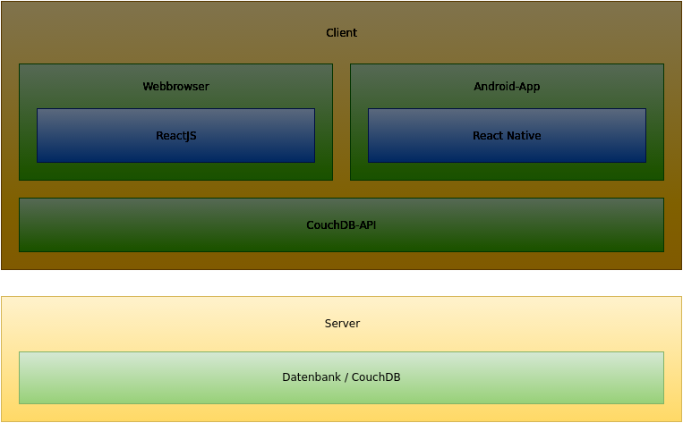
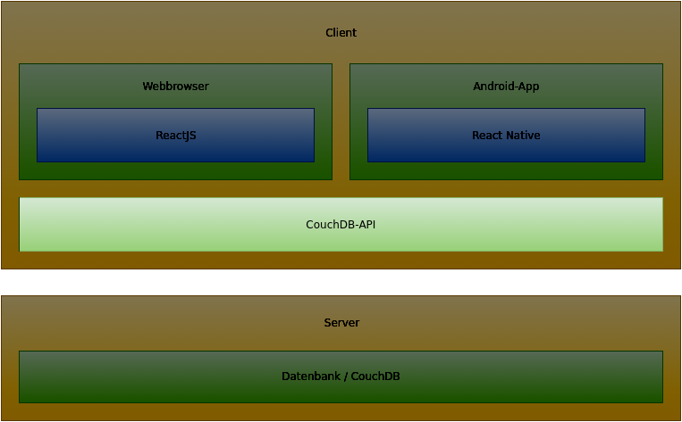
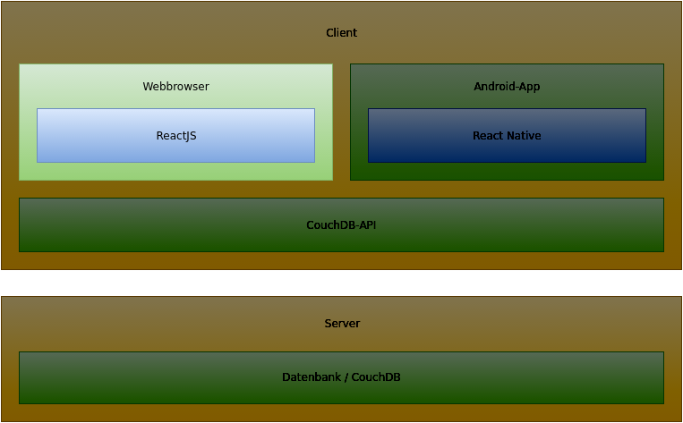
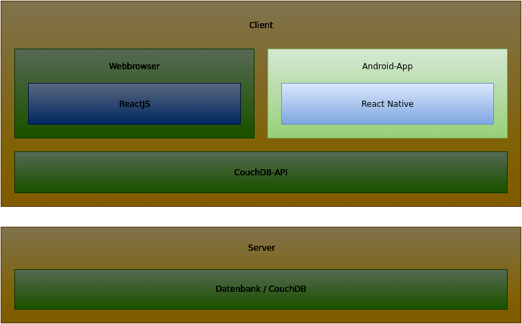

class: center middle

# Find.Me Architektur
### Ruben Gees, Alexej Esau

---

# Inhaltsverzeichnis

- Überblick
- CouchDB
  - API
- React.js Website
- Reacht Native App

---

# Überblick: Architekturdiagramm


---

# CouchDB



---

.left-column[
## CouchDB
### Übersicht
]

.right-column[
- NoSQL Datenbank

  - Dokumentenbasiert

- Persistierung der Daten
]

---

# CouchDB API



---

.left-column[
## CouchDB API
### Übersicht
]

.right-column[
#### Ziel: Saubere Schnittstelle/Abstraktion zur Datenbank
- Enthält Sammlungen von DAOs

- Sowohl für React.js als auch für React Native
]

---

.left-column[
## CouchDB API
### Übersicht
### DAO
]

.right-column[
- Zugriffsschnittstelle für bestimmten Dokumententyp

- Bietet Methoden zum...

  - Erstellen von Objekten

  - Aktualisieren von Objekten

  - Löschen von Objekten

  - Suchen von Objekten anhand von Kriterien (Id, Name, ...)
]

---

.left-column[
## CouchDB API
### Übersicht
### DAO
### Beispiel: User
]

.right-column[
```javascript
let dm = new CouchDbApi.DaoManager(connSettings);
let userDao = dm.getDao(CouchDbApi.UserDAO);

userDao.findByLogin(login, {
    success: function(data) {
        //Do something with the data
    },
    error: function(err) {
        // Log/Show/Handle error
    }
});
```
]

---

# React.js Website



---

# Reacht Native App



---
